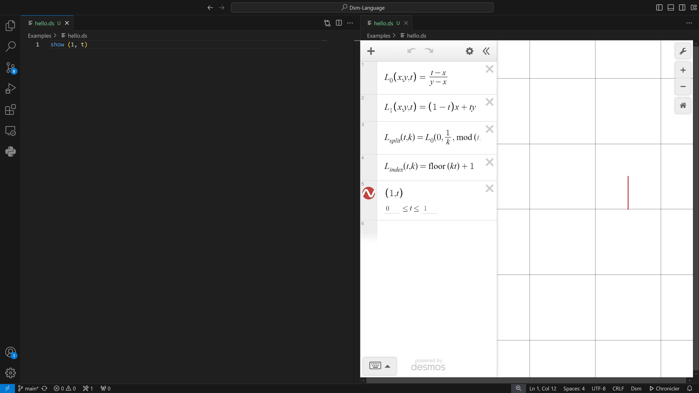

# TL;DR
The `Dsm` language turns [Demos](https://www.desmos.com/) into a programming language.
This extension imlpements everything you need to write `Dsm` code:

<video src="oly-720p.mp4" width="1280" height="720" controls></video>

## Why turn Desmos to a Programming Language?
* Text files are easier and faster to interact with
    - Copy-Pasting
    - Avoiding the mouse
    - Can use [Git](https://www.git-scm.com/)
    - Programmability: generate Dasm code using scripts
* Language features
    - Loops
    - Expression composition
    - Libraries
    - Nice multi-character identifiers
* Develop from VScode instead of Browser
    - Multi-Cursors
    - Color Themes
    - Whatever extensions you are used to

# How to use
## Setting up
0. Install [the extension](https://marketplace.visualstudio.com/items?itemName=octopus-writer.dsm-language).
1. create a text file with the suffix `.ds`.
2. open this text file in the editor.
3. run the command (`Ctrl+Shift+P`): `Open Dsm View beside source`.
4. write `show (1, t)` in the text file.
4. make sure the file is saved (`Ctrl+S`).
5. You should see something like:
    

## Language
The syntax disregards spaces, tabs and newlines.

### Confusing bits
The `t` parametric is strange when starting up.
Try to understand the section about it and the one on curves if you are using them and getting strange syntax errors.

### Show
The `show <Expression>` statment displays the expression on the graph. For example
```ds
show (1,3)
show (1, t)
```
will plot a point at `(1,3)`, and a line going from `(1, 0)` to `(1, 1)`.

Note how `t` is implicitly declared in the scope of the `show` statement, and how it's (default) value range is `[0, 1]`.

### The `t` Parametric
`t` is specian is `Dsm`. It is reserved to be the parametric value.
This means you cannot declare variables or arguments with this name, and it behaves differently.

### Function
The syntax goes something like: `func <Func-Name>(<Args>...): <Expression>`.
Where the function is evaluated to the expression.

For example:
```ds
func bar(y):
    y+1

func foo(x):
    bar(x)*2
```
Here `foo(3) = bar(3)*2 = 4*2 = 8`

### Curve
A curve is like a function, but like in the `show` statement - the `t` parametric is implicitly declared as the first argument.
The syntax goes like `curve <Curve-Name>(<Args>...): <Statements>...`

For example:
```ds
curve circle(radius):
    (cos(2*pi*t), sin(2*pi*t))*radius

show circle(t, 2)
```
Will draw a circle with radius 2.

Statements can be expressions, but they can also do more compilcated things involving the parametric.
See the sections on the specific statements

### `for` Statement
The syntax is `for <i> in <max-value>: <statement>...`.
Here `<i>` declares a new variable in the scope of the loop, and the values taken by it will be `[1, 2, ..., <max-value>]` (note it can be less then 2).
Example:
```ds
curve lines(n):
    for i in n:
        (t, i)
show lines(t, 3)
```
This will draw 3 lines: from `(0, 1)` to `(1, 1)`, from `(0, 2)` to `(1, 2)` and from `(0, 3)` to `(1, 3)`.

### Compound Statement
The syntax is `<statement> ~ <statement>`.
Example:
```ds
curve waves():
    (t, sin(t))
    ~
    (t, cos(t))

show waves(2*pi*t)
```
will draw both a sin and a cosine wave in the range `[0, 2*pi]` on the x axis.
